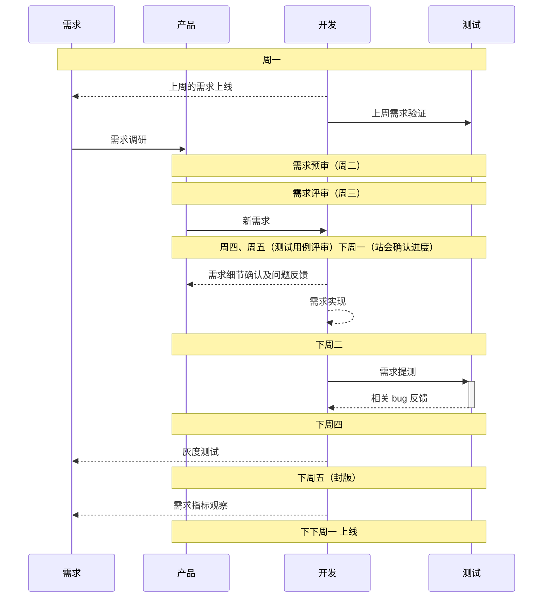

## 说明

用于帮助后端开发人员迅速熟悉 **进圈** 的开发流程和开发规范。

### 人员说明

后端分为两组，用来协同开发，快速迭代。

> 请注意自己的组别，钉钉群中会有相关的消息是按组通知的。

### 需求开发流程

每次需求开发时间上基本是以 **两个星期** 为一个版本基准。

简版需求流程如下所示：

> 参考：[日常需求开发相关流程 - 盒子后端](http://wiki.liquidnetwork.com/pages/viewpage.action?pageId=37029992) 

#### 开发流程：

- 产品提出需求，编写需求文档，开需求预审会。审计需求
- 项目需求评审会。文档形式统一说明需求任务并分配给指定小组。
- 后端小组再根据具体情况分配具体任务。以文档形式说明。（此时组长会新建一个指定的版本作为需求开发的起始版本，如 `v22.04.06`.其他相关开发人员应以此版本为基础，新建开发分支，自行开发）
- 自己开发完成后，可进行自己的测试。
  - 可以本地测试。
  - 如果本地环境不全。可以通过堡垒机登录到 `poros-test`机器下的`~/hp/poros`项目，切换到你的开发分支，并使用 `supervisorctl`重启相关的改动。利用测试机的`82`端口进行自测
- 自测完成后，可以进行本地合并到版本分支（`v22.04.06`）
- 使用测试机器`~/poros`文件夹，重启`supervisorctl`相关改动。使用`80`端口再次测试。

#### 开发规范

后端研发规范：

- [Git工作流及代码提交相关](http://wiki.liquidnetwork.com/pages/viewpage.action?pageId=66202214)
- [编码规范（举例篇）](http://wiki.liquidnetwork.com/pages/viewpage.action?pageId=66202123)
- [编码规范（基础篇）](http://wiki.liquidnetwork.com/pages/viewpage.action?pageId=66202068)
